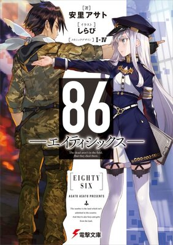
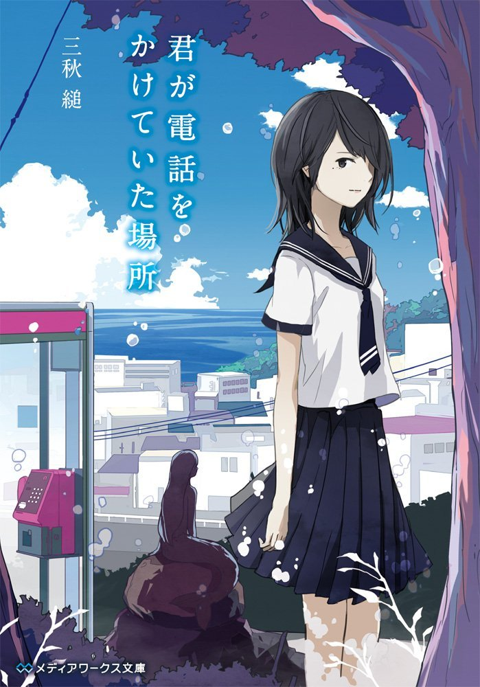
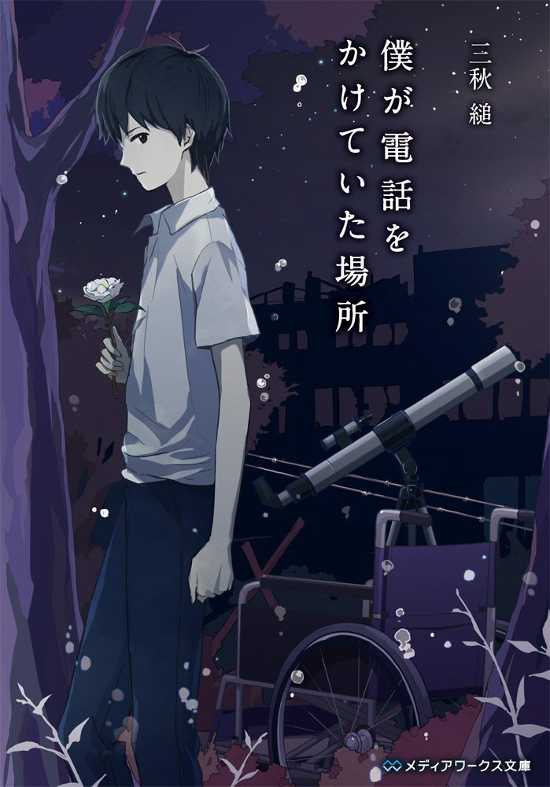
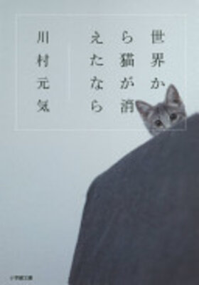
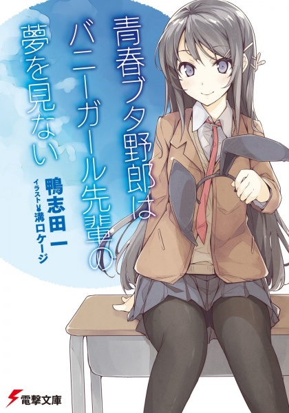

## Introduction
The tried and true way to learn Japanese is to read Japanese media. I figured I might as well document all the books I read and my thoughts on them as I go :). Do note that the scores are positively biased, as any books that I don't like (thus scoring lower) I will probably just stop reading. 

## 86 [↗](https://jiten.moe/decks/media/54961/detail)
|                                  |                                                                                                                                                                                                                                                                                                                                                                                                                                      |
| :------------------------------- | :----------------------------------------------------------------------------------------------------------------------------------------------------------------------------------------------------------------------------------------------------------------------------------------------------------------------------------------------------------------------------------------------------------------------------------- |
|  | Very difficult read technicality-wise, as there's lots of N1 grammar, obscure military terms, compound kanji words, and to top it off German loan-words. Interesting themes and amazing story. One small gripe was that Asato Asato seems to really like spoon-feeding you, the reader, the themes of the book (e.g. explicitly pointing out the obvious themes in the story). Excited to read on.   **8/10** Would recommend! |
## 君が電話をかけていた場所・僕が電話をかけていた場所 [↗](https://www.goodreads.com/zh/book/show/31689502)

|                                          |                                                                                                                                                                                                                                                            |
| :--------------------------------------- | :--------------------------------------------------------------------------------------------------------------------------------------------------------------------------------------------------------------------------------------------------------- |
|  | Fairly pleasurable read with two volumes. One thing that stood out to me here was that the MMC fell in love with the FMC in elementary school, which I think that's pretty ridiculous. I was probably eating crayons in elementary school.  **5/10** |
|  |                                                                                                                                                                                                                                                            |

## 世界から猫が消えたなら [↗](https://jiten.moe/decks/media/105479/detail "View book")

|                                    |                                                                                                                                                                                                                                                                                      |
| :--------------------------------- | :----------------------------------------------------------------------------------------------------------------------------------------------------------------------------------------------------------------------------------------------------------------------------------- |
|  | Very interesting premise, though I feel as if the author could've done more with it. I feel like the main character just doesn't feel human enough; His experiences come off as very "uncanny" or "unnatural". Nonetheless an emotional read for a cat lover like me  **6/10** |
## 青春ブタ野郎はバニーガール先輩の夢を見ない [↗](https://jiten.moe/decks/media/95367/detail "View on Jiten")

|                                      |                                                                                                                                                                                                                                                                                         |
| :----------------------------------- | :-------------------------------------------------------------------------------------------------------------------------------------------------------------------------------------------------------------------------------------------------------------------------------------- |
|  | My first ever book read in Japanese. I blazed through it in about two days because I'd already watched the anime (but forgot most of the plot points as it was so long ago). Interesting read, interesting story, although I did find most of the ecchi humor childish.  **7/10** |
